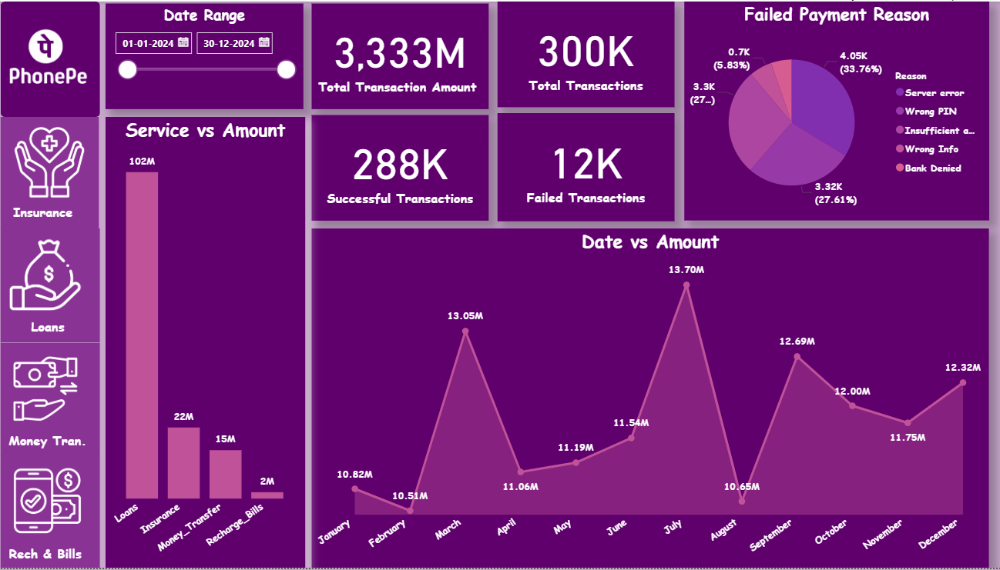
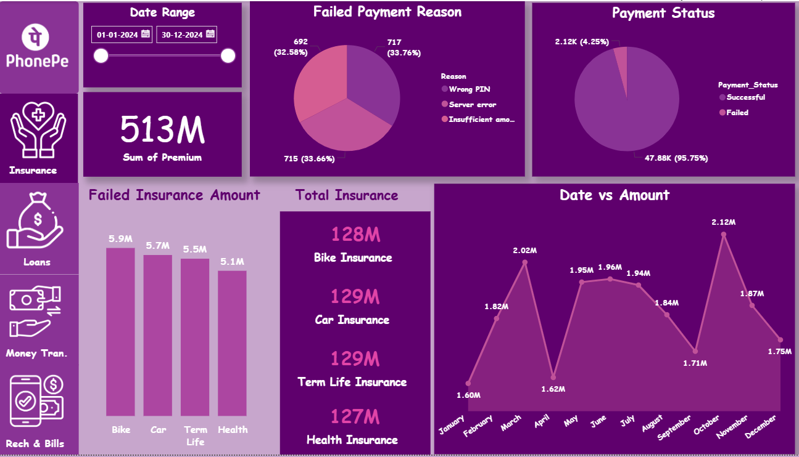
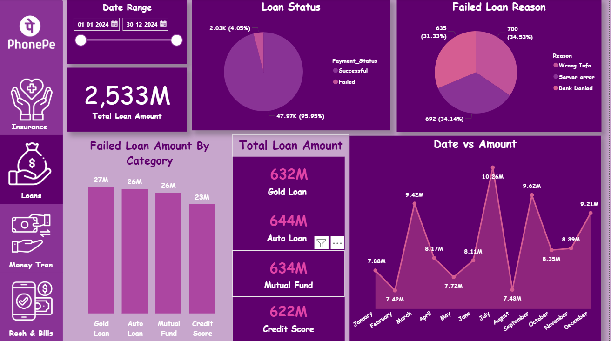
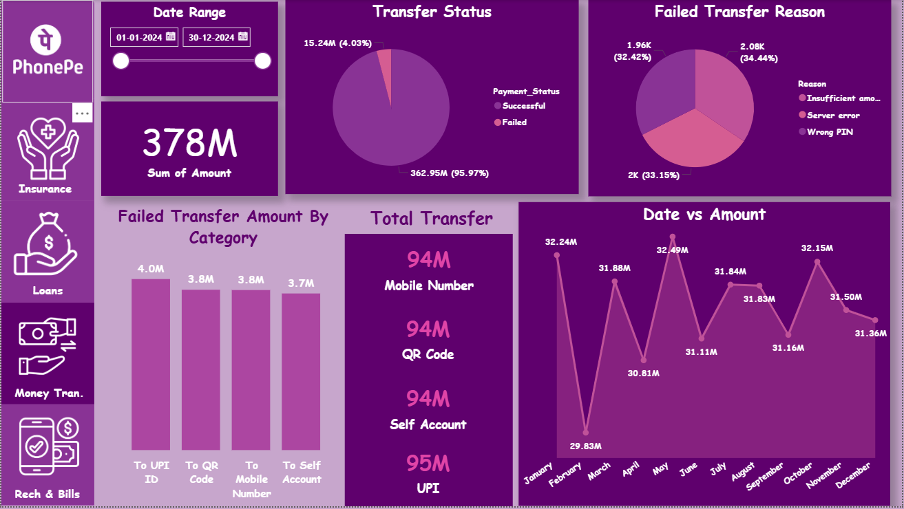
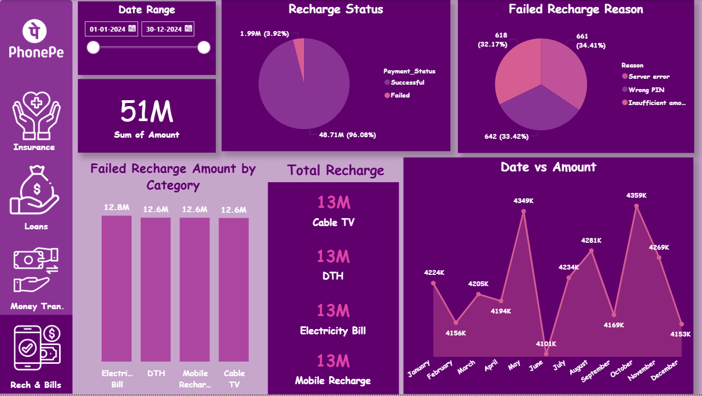

# PhonePe Transaction Analysis Dashboard (Power BI)

## Project Overview

This project presents an interactive **Power BI dashboard** analyzing digital payment transactions similar to the **PhonePe ecosystem**.

The dashboard provides insights into:

* Transaction volume and total amount
* Payment success vs failure rates
* Service-wise performance
* Monthly transaction trends
* Failure reason analysis

The goal of this project is to demonstrate **data analysis, business insight generation, and dashboard design using Power BI**.

---

# Dashboard Screenshots

## 1. Transaction Overview



This page provides a high-level view of the platform including:

* Total transaction amount
* Total transactions
* Successful vs failed payments
* Service-wise transaction distribution
* Monthly transaction trend

---

## 2. Insurance Analysis



Key insights include:

* Total premium collected
* Insurance category comparison
* Failed insurance transactions
* Monthly premium trends

Insurance categories analyzed:

* Bike Insurance
* Car Insurance
* Term Life Insurance
* Health Insurance

---

## 3. Loan Analysis



Loan service insights include:

* Total loan amount processed
* Loan category distribution
* Failed loan reasons
* Monthly loan transaction trends

Loan categories include:

* Gold Loan
* Auto Loan
* Mutual Fund
* Credit Score related loans

---

## 4. Money Transfer Analysis



Transfer transaction analysis across:

* UPI
* QR Code
* Mobile Number
* Self Account Transfer

Includes success rate, failure breakdown, and monthly trends.

---

## 5. Recharge & Bills Analysis



Recharge and bill payment insights including:

* Electricity Bill
* Mobile Recharge
* DTH
* Cable TV

Shows category-wise recharge volume and monthly recharge trends.

---

# Key Insights

Some key observations from the dashboard:

* More than **95% of transactions are successful**.
* The most common payment failure reasons are:

  * Server errors
  * Wrong PIN
  * Insufficient balance
* **Loan services generate the highest transaction amount** among all services.
* Monthly trends show **clear fluctuations in user activity**.

---

# Business Recommendations

Based on the analysis:

* Improve **server stability** to reduce server-related failures.
* Implement **smart retry options** for failed payments.
* Add **balance warning prompts** before payment attempts.
* Monitor **monthly spikes in transaction volume** to manage system load.

---

# Tools & Technologies

* **Power BI**
* Data Visualization
* Data Modeling
* Business Intelligence
* Data Analysis

---

# Repository Structure

```
phonepe-transaction-analysis-powerbi
│
├── Icons
│   ├── Insurance.png
│   ├── ph logo.png
│   ├── Loans.png
│   ├── MT.png
│   └── Recharge & Bills.png
├── phonepe_dataanalysis.pbix
├── dataset.xlsx
├── screenshots
│   ├── overview.png
│   ├── insurance.png
│   ├── loans.png
│   ├── transfer.png
│   └── recharge.png
└── README.md
```

---

# How to Use

1. Download the `.pbix` file from this repository.
2. Open it using **Microsoft Power BI Desktop**.
3. Interact with filters and explore the dashboards.

---

# Author

Mahima

This project is part of my **Data Analytics portfolio** demonstrating dashboard design, exploratory analysis, and business insight generation using Power BI.
